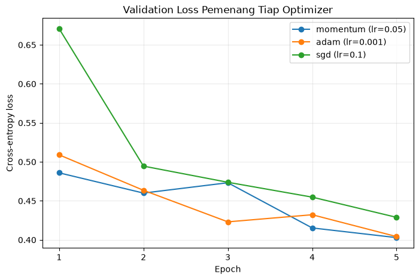

# Laporan Praktikum M03 - Optimizer dan Strategi Pelatihan

## Identitas Praktikan

| Komponen | Isian |
|---|---|
| Nama | Fadil Prasetyo Alfarizzi |
| NIM | 123450048 |
| Kelas | RC |
| Modul | M03 - Optimizer dan Strategi Pelatihan |
| Tanggal praktikum | 2026-09-29 |
| Seed/varian individual | 48 (empat digit terakhir NIM) |
| Device | CPU, laptop Windows lewat Local Runner Data Science Workbench |

## Ringkasan Singkat

Praktikum ini membandingkan SGD, SGD+momentum, dan Adam untuk melatih MLP 784-128-10 pada subset Fashion-MNIST dengan anggaran tetap 5 epoch (470 update pada batch 128). Dari sembilan run terkendali, SGD+momentum η = 0,05 memperoleh validation loss terendah 0,4029 (akurasi 0,8590) dengan 0,55 detik per epoch, tipis di atas Adam η = 10⁻³ (0,4042) yang membutuhkan 0,65 detik per epoch; SGD terbaik (η = 0,1) tertinggal di 0,4289. Pada konfigurasi itu, CosineAnnealingLR menurunkan validation loss menjadi 0,3744 tanpa menambah update, sedangkan batch 32 justru memburuk (0,7179) dan batch 512 paling cepat (0,29 detik per epoch) dengan loss 0,4281. Berdasarkan validation loss, biaya waktu, dan stabilitas kurva, SGD+momentum η = 0,05 dengan batch 128 dipilih sebagai model final; evaluasi uji satu kali menghasilkan test loss 0,446 dan akurasi 0,8511.

## 1. Tujuan dan Hipotesis

### 1.1 Tujuan

1. Memilih optimizer dan learning rate terbaik dari sembilan run terkendali berdasarkan validation loss.
2. Mengukur apakah StepLR dan CosineAnnealingLR memperbaiki validation loss pada anggaran 5 epoch yang sama.
3. Membandingkan batch 32, 128, dan 512 dari sisi validation loss dan waktu per epoch.

### 1.2 Hipotesis sebelum eksperimen

| Perbandingan | Prediksi | Alasan teknis |
|---|---|---|
| Adam η = 10⁻³ vs SGD dan SGD+momentum | Adam mencapai validation loss terendah dalam 5 epoch | Langkah adaptif per parameter tidak bergantung skala gradien sehingga cepat turun di awal |
| Batch 32 vs batch 512 | Batch 32 mencapai loss lebih rendah, batch 512 lebih cepat per epoch | Batch 32 mendapat 15 kali lebih banyak update; batch 512 memakai operasi matriks lebih besar |

## 2. Data dan Protokol Eksperimen

### 2.1 Dataset dan split

| Komponen | Nilai |
|---|---|
| Dataset | Fashion-MNIST (torchvision), citra grayscale 28 × 28 |
| Jumlah kelas/target | 10 kelas pakaian |
| Train | 12.000 contoh (20% dari 60.000 data latih resmi) |
| Validation | 3.000 contoh (5% dari 60.000 data latih resmi) |
| Test | 10.000 contoh (test set resmi) |
| Cara split | Terstratifikasi dengan `train_test_split`, `random_state = 48` (1.200 citra per kelas di train) |
| Praproses utama | Skala [0, 1], lalu normalisasi dengan mean 0,2863 dan std 0,3534 dari subset latih |

Normalisasi dihitung dari subset latih saja, dan test set hanya dipakai satu kali setelah konfigurasi final dipilih dari validation set.

### 2.2 Konfigurasi yang dikendalikan

| Komponen | Nilai yang digunakan |
|---|---|
| Arsitektur dasar | MLP 784 → 128 (ReLU) → 10, 101.770 parameter |
| Loss function | Cross-entropy |
| Optimizer | SGD, SGD+momentum 0,9, Adam |
| Learning rate | SGD {0,01; 0,1; 0,5}, momentum {0,01; 0,05; 0,1}, Adam {10⁻⁴; 10⁻³; 10⁻²}; baseline SGD {0,001; 0,1; 1,0} |
| Batch size | 128 (eksperimen batch: 32 dan 512) |
| Epoch/jumlah update | 5 epoch; 470 update pada batch 128 |
| Seed | 48 |
| Kriteria pemilihan model | Validation loss terendah |
| Batas komputasi | 15 run di CPU, 1,4–6,1 detik per run |

**Variabel yang dibuat sama untuk seluruh run:** split, seed inisialisasi bobot, urutan batch, arsitektur, loss, jumlah epoch, dan fungsi `jalankan()` yang sama.  
**Variabel yang sengaja diubah:** satu faktor per run, yaitu optimizer dan learning rate (bagian C–D), scheduler, atau batch size (bagian F).

### 2.3 Lingkungan eksekusi

```text
Python     : 3.13.14
PyTorch    : 2.14.0+cpu
NumPy      : 2.5.3
Device     : CPU
Runtime    : Lokal (Local Runner Data Science Workbench)
```

## 3. Implementasi dan Pemeriksaan Kebenaran

| Pemeriksaan | Nilai yang diharapkan | Hasil aktual | Status |
|---|---:|---:|---|
| Jumlah parameter MLP | 101.770 | 101.770 | Lulus |
| Stratifikasi subset latih | 1.200 per kelas | 1.200 per kelas | Lulus |
| Jumlah update batch 32 / 128 / 512 | 1.875 / 470 / 120 | 1.875 / 470 / 120 | Lulus |
| Latih ulang konfigurasi final | val loss 0,4029 | 0,4029 | Lulus |

**Temuan dari pemeriksaan:** arsitektur dan split sesuai protokol modul, dan jumlah update per batch size cocok dengan ⌈12.000/B⌉ × 5. Latih ulang dari seed yang sama mereproduksi validation loss run terpilih, sehingga hasil deterministik untuk seed 48 dan data uji cukup dievaluasi satu kali pada model tersebut.

## 4. Hasil Eksperimen

### 4.1 Tabel hasil utama

| Run | Perubahan utama | Parameter | Train loss | Val. loss | Val. acc | Waktu/epoch (s) | Catatan |
|---|---|---:|---:|---:|---:|---:|---|
| `grid_sgd_lr0.01` | SGD, η = 0,01 | 101.770 | 0,6042 | 0,6000 | 0,7950 | 0,565 | grid; status=ok |
| `grid_sgd_lr0.1` | SGD, η = 0,1 | 101.770 | 0,4013 | 0,4289 | 0,8430 | 0,560 | grid; status=ok |
| `grid_sgd_lr0.5` | SGD, η = 0,5 | 101.770 | 0,4852 | 0,6107 | 0,7797 | 0,585 | grid; status=ok |
| `grid_momentum_lr0.01` | Momentum, η = 0,01 | 101.770 | 0,3991 | 0,4298 | 0,8503 | 0,564 | grid; status=ok |
| `grid_momentum_lr0.05` | Momentum, η = 0,05 | 101.770 | 0,3365 | 0,4029 | 0,8590 | 0,547 | grid; status=ok |
| `grid_momentum_lr0.1` | Momentum, η = 0,1 | 101.770 | 0,4282 | 0,5243 | 0,8347 | 0,545 | grid; status=ok |
| `grid_adam_lr0.0001` | Adam, η = 10⁻⁴ | 101.770 | 0,5336 | 0,5325 | 0,8137 | 0,633 | grid; status=ok |
| `grid_adam_lr0.001` | Adam, η = 10⁻³ | 101.770 | 0,3620 | 0,4042 | 0,8573 | 0,647 | grid; status=ok |
| `grid_adam_lr0.01` | Adam, η = 10⁻² | 101.770 | 0,3628 | 0,4796 | 0,8423 | 0,643 | grid; status=ok |
| `scheduler_none_momentum_lr0.05` | Tanpa scheduler | 101.770 | 0,3365 | 0,4029 | 0,8590 | 0,571 | scheduler; status=ok |
| `scheduler_step_momentum_lr0.05` | StepLR | 101.770 | 0,2915 | 0,3803 | 0,8677 | 0,581 | scheduler; status=ok |
| `batch_32_momentum_lr0.05` | Batch 32 | 101.770 | 0,6379 | 0,7179 | 0,7393 | 1,217 | batch; status=ok |
| `batch_512_momentum_lr0.05` | Batch 512 | 101.770 | 0,3822 | 0,4281 | 0,8503 | 0,288 | batch; status=ok |
| `scheduler_cosine_momentum_lr0.05` | CosineAnnealingLR | 101.770 | 0,2847 | 0,3744 | 0,8687 | 0,551 | scheduler; status=ok |
| `batch_128_momentum_lr0.05` | Batch 128 | 101.770 | 0,3365 | 0,4029 | 0,8590 | 0,551 | batch; status=ok |

### 4.2 Grafik atau visualisasi utama



**Gambar 1.** Validation loss per epoch untuk pemenang tiap optimizer (batch 128, 5 epoch, split validasi 3.000 citra). Garis biru momentum η = 0,05, oranye Adam η = 10⁻³, hijau SGD η = 0,1.

**Temuan dari Gambar 1:** momentum dan Adam sudah di bawah 0,51 setelah epoch 1, sedangkan SGD masih 0,671. Kurva momentum naik sesaat di epoch 3 (0,460 ke 0,473) sebelum turun ke 0,4029.

## 5. Analisis dan Pembahasan

| Unsur | Isi |
|---|---|
| Klaim | Scheduler yang menurunkan learning rate di akhir pelatihan memperbaiki hasil tanpa menambah biaya. |
| Bukti | Pada 470 update yang sama, validation loss turun dari 0,4029 (tanpa scheduler) menjadi 0,3803 (StepLR) dan 0,3744 (cosine); waktu per epoch tetap 0,55–0,58 detik (Tabel 4.1). |
| Penalaran | Dengan η = 0,05 tetap, momentum masih melompati dasar lembah (kenaikan di epoch 3). Learning rate yang mengecil (0,025 lalu 0,0125 pada StepLR; 0,005 di epoch 5 pada cosine) memperkecil langkah sehingga model mengendap ke minimum. |

1. **Perbandingan dengan hipotesis:** hipotesis optimizer ditolak tipis. Adam η = 10⁻³ (0,4042) kalah 0,0013 dari momentum η = 0,05 (0,4029), selisih yang jauh lebih kecil daripada jarak keduanya ke SGD (0,4289). Hipotesis batch hanya benar untuk kecepatan: batch 512 paling cepat (0,29 vs 1,22 detik per epoch), tetapi validation loss batch 32 justru paling buruk (0,7179 vs 0,4281).
2. **Run terbaik dan run terburuk:** terbaik CosineAnnealingLR (0,3744); terburuk batch 32 (0,7179, akurasi 0,7393). Di antara run grid, learning rate yang terlalu besar paling buruk: SGD η = 0,5 (0,6107), momentum η = 0,1 (0,5243), dan Adam η = 10⁻² (0,4796). Validation loss ketiganya naik-turun mulai epoch 3–4 karena langkahnya melompati minimum.
3. **Trade-off:** Adam sekitar 15% lebih lambat per epoch (0,63–0,65 vs 0,55–0,59 detik) tanpa keuntungan kualitas. Batch 512 1,9 kali lebih cepat daripada batch 128, tetapi validation loss-nya 0,025 lebih tinggi.
4. **Anomali atau hasil gagal:** batch 32 lebih buruk walaupun mendapat 15 kali lebih banyak update. Learning rate 0,05 dengan momentum 0,9 disetel untuk batch 128; pada batch 32 gradien jauh lebih berderau dengan besar langkah yang sama, sehingga model berosilasi; validation loss-nya naik dari 0,708 ke 0,855 di epoch 2–3.
5. **Generalisasi:** gap train–validation konfigurasi final kecil (0,337 vs 0,403). Test loss 0,446 sedikit di atas validation loss, wajar karena konfigurasi dipilih dari validation set.

## 7. Kesimpulan dan Keterbatasan

### 7.1 Kesimpulan

Dengan protokol yang setara, SGD+momentum η = 0,05 dan batch 128 dipilih sebagai konfigurasi final (validation loss 0,4029, test accuracy 0,8511). Adam η = 10⁻³ setara kualitasnya (0,4042) tetapi sekitar 15% lebih lambat per epoch. CosineAnnealingLR memperbaiki hasil pada anggaran yang sama (0,3744), dan batch 128 memberi kompromi kualitas–waktu terbaik dibanding batch 32 (0,7179; 1,22 detik per epoch) dan batch 512 (0,4281; 0,29 detik per epoch).

### 7.2 Keterbatasan

- Satu seed dan subset 12.000 citra membuat selisih kecil seperti momentum vs Adam (0,0013) tidak dapat dibedakan dari variasi antar-seed.
- Anggaran 5 epoch menguntungkan optimizer yang cepat di awal; batch size diuji tanpa menyetel ulang learning rate; waktu diukur di CPU laptop yang berderau sehingga tidak berlaku umum untuk GPU.

### 7.3 Tindak lanjut

Mengulang tiga pemenang dan scheduler cosine pada 3–5 seed, karena itulah cara paling murah untuk memastikan apakah selisih momentum vs Adam nyata atau hanya variasi seed.

## Referensi

1. Xiao, H., Rasul, K., & Vollgraf, R. 2017. Fashion-MNIST: a Novel Image Dataset for Benchmarking Machine Learning Algorithms. https://arxiv.org/abs/1708.07747
2. Dokumentasi PyTorch 2.14, `torch.optim` dan `torch.optim.lr_scheduler`. https://pytorch.org/docs/stable/optim.html

## Pernyataan Orisinalitas

Saya menyatakan bahwa kode, eksperimen, analisis, dan laporan ini merupakan
pekerjaan individual. Semua sumber eksternal, termasuk potongan kode, telah
dicantumkan. Saya memahami bahwa kemiripan hasil akibat seed atau data yang
sama tidak membenarkan penyalinan notebook maupun analisis.

**Nama:** Fadil Prasetyo Alfarizzi  
**Tanggal:** 2026-09-29

---

## Checklist Sebelum Mengumpulkan

- [x] Nama berkas adalah `M03_123450048.md` dan `M03_123450048.pdf`.
- [x] Identitas, seed, device, dan versi library telah diisi.
- [x] Isi laporan tidak melebihi batas halaman modul.
- [x] Protokol sama dengan modul atau setiap perubahan telah dijelaskan.
- [x] Tabel hasil konsisten dengan `M03_123450048_metrics.csv`.
- [x] Seluruh run dicantumkan, termasuk run yang gagal atau buruk.
- [x] Grafik memiliki judul, label sumbu, legenda, dan caption.
- [x] Setiap klaim utama disertai angka atau rujukan gambar/tabel.
- [x] Test set tidak digunakan untuk memilih model atau hyperparameter.
- [x] Kesimpulan menjawab tujuan dan menyebutkan trade-off.
- [x] Sumber eksternal telah dicantumkan.
- [x] Pernyataan orisinalitas telah diisi.
- [x] Notebook lolos **Restart Kernel and Run All**.
- [x] Tiga berkas pengumpulan (`ipynb`, `pdf`, dan `metrics.csv`) tersedia.
